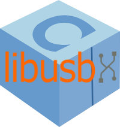

   

# conan-libusb

# A cross-platform library to access USB devices

[Conan.io](https://conan.io) package for [libusb](http://libusb.info/) project

The packages generated with this **conanfile** can be found in [conan.io](https://conan.io/source/libusb/1.0.21/uilianries/stable).

## Build packages

Download conan client from [Conan.io](https://conan.io) and run:

    $ python build.py

If your are in Windows you should run it from a VisualStudio console in order to get "mc.exe" in path.

## Upload packages to server

    $ conan upload libusb/1.0.21@uilianries/stable --all

## Reuse the packages

### Basic setup

    $ conan install libusb/1.0.21@uilianries/stable

### Project setup

If you handle multiple dependencies in your project is better to add a *conanfile.txt*

    [requires]
    libusb/1.0.21@uilianries/stable

    [options]
    libusb:shared=True # False

    [generators]
    txt
    cmake

Complete the installation of requirements for your project running:</small>

    conan install .

Project setup installs the library (and all his dependencies) and generates the files *conanbuildinfo.txt* and *conanbuildinfo.cmake* with all the paths and variables that you need to link with your dependencies.

### License
[LGPL-2.1](LICENSE)
